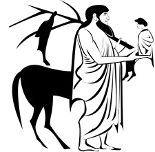

# Paideia Institute Style Guide for Digital Initiatives

1. [Introduction](#introduction)
2. [Colors](#colors)
3. [Logos](#logos)
4. [Fonts](#fonts)
  * [Paragraph](#paragraph)
  * [Title](#title)
  * [Menu Link](#menu-link)
  * [Nav Link](#nav-link)
  * [Button](#button)
  * [Paideia Logo](#paideia-logo)
5. [Navbar](#navbar)
  * [Search Bar](#search-bar)
  * [Logo](#logo)
6. [Footer](#footer)

## Introduction

Components named will be capitalized and referenced as titled (Colors, Footer, etc.).

For a live example Paideia site with all HTML/CSS using Bootstrap 4 please see [this CodePen](https://codepen.io/kamillamagna/pen/wpXVWJ) and feel free to use it as a starting template.

## Colors

### Paideia Blue 
* #5297CB
* bottom border of Navbar
* background of Footer
* background of Button
* text of Link
* top or bottom border of Nav Menu on hover
* option for titles on homepage

### Paideia Light Blue 
* #E6F7FF

### Paideia Dark Blue 
* #3070A0
* Link on hover
* background of Button on hover

### Paideia Hover Blue 
* #0078A0
* text of Nav Menu on hover

### Paideia Title Blue 
* #3C4E62
* option for titles on homepage

## Logos

The logo is transparent and should be displayed on a white background. Both are included in this repo.

[The full logo](./paideia.png):

[Chiron](./chiron.png) (recommended for mobile and other smaller spaces):

## Fonts
Site text should all be **[Lato](https://fonts.google.com/specimen/Lato)** family.

### Paragraph
  * 16px
  * regular weight
  * black

### Title

* uppercase
* heavy weight
* may be any Paideia color but should be consistent throughout the project
* conforms to HTML standard headers (h1 to h6)
* centered on page

### Menu Link

Main menu items like 'Home', 'Programs', 'Outreach'

* Paideia Hover Blue on hover
* normal weight
* black
* uppercase
* 24px

### Nav Link

Submenu items like 'Programs > **Living Latin in Gaul**', 'Outreach > **Aequora**'

* 4.8px Paideia Blue top or bottom border on hover
* normal weight
* black
* uppercase
* 24px

### Button

* 18.2px font-size
* 55px height

### Paideia Logo

For reference, the Logo's font is **[Marcellus](https://www.fontzillion.com/fonts/astigmatic-one-eye-typographic-institute/marcellus)**

## Navbar

**Uniform navbar styling across all Paideia Digital Humanities initiatives is the best way to maintain continuity and 'brand recognition' for our users.**

* may be fixed (see: [OPCA](http://opca.paideiainstitute.org/)) or not (see: [homepage](http://www.paideiainstitute.org/)) depending on the goals of the project
* 103 pixels in height
* spans the entire page width
* white background
* black text
* bordered on the bottom by a 10px strip of Paideia Blue for a total height of 113 pixels

### Search Bar
* interior box shadow
* Helvetia italic placeholder text
* see [button](#button) for accompanying button style

### Logo
* max height of 60px
* white background
* hyperlinks to Paideia Website (http://www.paideiainstitute.org/)

## Footer
* heavy weight
* uppercase
* 14.4px
* background Paideia Blue
* text centered
* spans entire width of page
* contains a copyright statement with including a link to the Paideia Institute:

It is recommended to programmatically insert year to keep site up-to-date.
